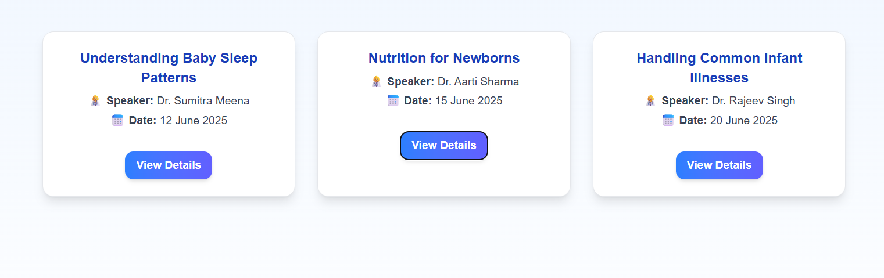

# 👶 Babynama Intern Assignment

This project was built as part of the Babynama Internship assignment. It displays a simple and beautiful list of upcoming live webinars to help busy parents stay informed.

## 🔗 Live URL
[https://babynama.vercel.app](https://babynama.vercel.app)

---

## ✅ Choices Made

- I created the `/webinars` page using a **responsive grid layout** built with **Tailwind CSS** to ensure a clean and professional UI.
- For simplicity, I kept all the logic (mock data and event handling) in a **single `page.jsx` file** under `/webinars`.
- Used `console.log()` for button interactivity as required, logging the clicked webinar's ID.

---

## 🧠 Roadblock & Learning

At first, I cloned someone else's GitHub repo and got a **403 permission error** while trying to push my changes.  
After researching, I learned that:
- I needed to **remove the existing `.git` folder**
- Then **re-initialize Git** using `git init`
- Finally, I **pushed to my own GitHub repository**.

It was a good learning experience in resolving version control issues.

---

## 📸 Screenshot



> A simple, informative, and responsive webinar listing page with speaker, date, and a “View Details” button.

---

## 🛠️ Tech Stack

- [Next.js](https://nextjs.org/)
- [React.js](https://reactjs.org/)
- [Tailwind CSS](https://tailwindcss.com/)

---

## 🚀 How to Run Locally

```bash
git clone https://github.com/KPrachiiee/babynama.git
cd babynama
npm install
npm run dev
