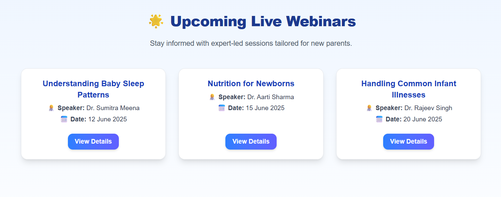

# Babynama - Frontend Developer Intern Assignment

🔗 Live URL
https://babynama.vercel.app

✅ Choices Made
I created the /webinars page using a responsive grid layout with Tailwind CSS to make it look clean and professional. I kept all the logic in a single file for simplicity.

🧠 Roadblock & Learning
I initially cloned someone else’s repository and got a 403 error while pushing. I learned that I needed to remove the .git folder, reinitialize Git, and push it to my own GitHub repo.

📸 Screenshot

